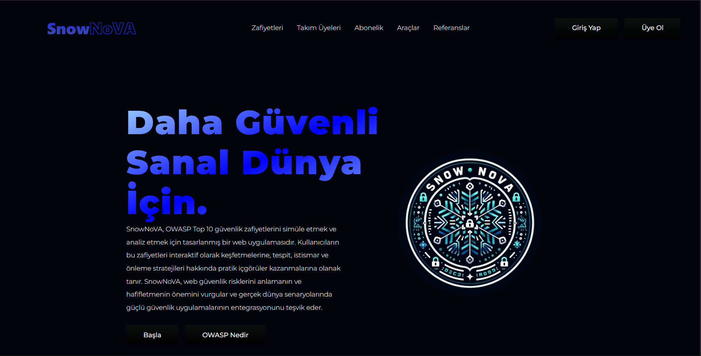

# SnowNoVA – Educational Web App Demonstrating OWASP Top 10 Vulnerabilities

SnowNoVA is a lightweight local web application created to demonstrate and explore key concepts from the OWASP Top 10.  
It is designed for educational purposes and runs locally using XAMPP. Each page showcases an insecure implementation alongside a more secure version for comparison.

## 🔍 What You'll Find in the Project

- Hands-on examples for well-known web vulnerabilities, including:
  - SQL Injection (SQLi)
  - Cross-Site Scripting (XSS)
  - Weak or Broken Authentication
  - Security Logging & Monitoring Failures
  - Software & Data Integrity Issues
- Each vulnerable page includes:
  - A short explanation of the vulnerability
  - How attackers might exploit it
  - A simple demonstration of a more secure solution
- Comparison between weak and improved logging techniques

## 🛠️ Technologies Used

- **Frontend:** HTML, CSS, basic JavaScript  
- **Backend:** PHP (served via XAMPP)  
- **Database:** MySQL  

## 🚀 How to Set It Up Locally

1. Place the project folder inside your XAMPP `htdocs` directory:  
   Example path: `C:\xampp\htdocs\SnowNoVA`

2. Open the XAMPP Control Panel and start **Apache** and **MySQL**.

3. Set up the MySQL database:
   - Navigate to `http://localhost/phpmyadmin`
   - Create a new database (e.g., `snow_nova`)
   - Import the provided `.sql` file to populate the database with demo/test data

4. Configure the database connection:
   - Open the project's PHP config file (e.g., `config.php` or `db/config.php`)
   - Update these fields with your local settings:
     - host (usually `localhost`)
     - username (default is `root`)
     - password (default is empty)
     - database name (`snow_nova` or the one you created)

5. Launch the app in your browser:  
   Visit `http://localhost/SnowNoVA`

> ⚠️ **Disclaimer:**  
> This application is intentionally vulnerable and is meant for educational/demo use only.  
> Never upload or run this project on a public-facing server or in a production environment.

  

